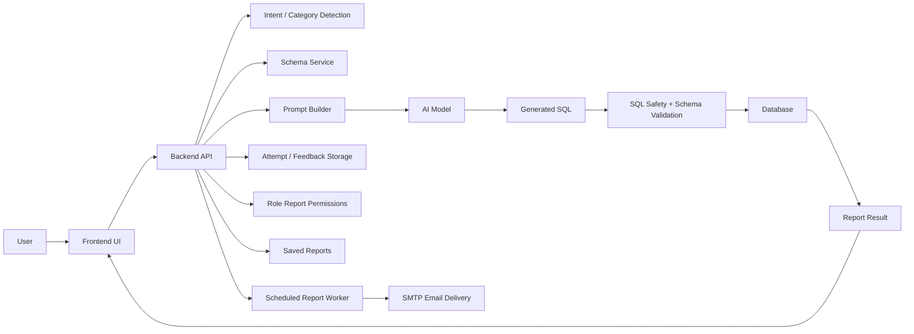

# AI-Based Reporting System - Project Planning Document

## 1. Purpose of This Document

This document explains how to plan, design, and develop an AI-based reporting system similar to the Devita AI Reporting System.

The goal of this type of system is simple:

> Allow users to ask business questions in normal language, convert those questions into safe SQL queries, run the queries on a database, and display the result as a report.

This document can be used before coding a similar project.

## 2. Business Problem

Most companies store useful data in databases, but non-technical users cannot directly write SQL queries. They depend on developers or analysts to create reports.

An AI reporting system solves this by allowing users to ask questions like:

- "Show active projects this month"
- "Give me revision summary by project"
- "Show employee attendance for April 2026"
- "Which projects used more actual hours than planned?"

The system converts the question into SQL, validates the SQL, runs it safely, and shows the result in a readable format.

## 3. Target Users

The system should be planned for these users:

- Business users who need reports but do not know SQL.
- Project managers who need project, task, revision, or performance reports.
- Admin users who review AI-generated SQL and approve correct examples.
- Developers who maintain schema, prompts, validation logic, and APIs.
- Management users who need quick summaries from operational data.

## 4. Main Features

The system should include:

- Natural-language report input.
- Report category selection or auto-detection.
- Database schema reading.
- AI SQL generation.
- SQL safety validation.
- Schema validation.
- Query execution.
- Report table display.
- Generated SQL preview.
- Error and retry handling.
- Admin review dashboard.
- Admin role-to-report permission management.
- Role-based report category access.
- Saved report access by role and report category.
- Audit logging for saved-report events and permission changes.
- Model/provider performance tracking.
- Scheduled report auto-generation.
- Super Admin-only schedule management and manual execution.
- Scheduled report email notifications with PDF/Excel attachments.
- Storage of successful and failed AI SQL attempts.
- Reusable report templates.
- Export options such as CSV, Excel, or PDF.

## 5. High-Level System Architecture



## 6. Recommended Technology Stack

### Frontend

- Next.js or React
- TypeScript
- Table component for report output
- Form controls for category, date range, filters, and provider selection

### Backend

- FastAPI, Django, Express, or similar API framework
- Pydantic or equivalent request/response validation
- SQLAlchemy or equivalent database layer
- HTTP client for AI provider calls

### Database

- MySQL, PostgreSQL, SQL Server, or any relational database
- Read-only database user for report execution
- Separate tables for AI attempts, feedback, and approved examples

### AI Providers

- OpenAI
- Gemini
- OpenRouter
- Local Ollama model

The system should be provider-independent so the model can be changed later.

## 7. Development Phases

### Phase 1: Requirement Gathering

Before coding, collect:

- List of reports users need.
- List of user roles.
- Database tables involved.
- Filters required by users.
- Output format needed.
- Security restrictions.
- Examples of real user questions.

Deliverables:

- Requirement document.
- Report list.
- User role list.
- Sample questions.

### Phase 2: Database Study

Understand the database before building AI logic.

Tasks:

- List all important tables.
- Identify primary keys and foreign keys.
- Document table relationships.
- Identify important date columns.
- Identify status columns.
- Identify business metrics.

Deliverables:

- Schema catalog.
- ER diagram.
- Table description document.
- Relationship document.

### Phase 3: Report Catalog Planning

Create a report catalog before writing prompts.

Each report should define:

- Report name.
- Report category.
- Required tables.
- Required columns.
- Filters.
- Metrics.
- Example questions.
- Example SQL if available.

Example:

```json
{
  "name": "Project Summary Report",
  "category": "project",
  "tables": ["projects", "product_task"],
  "metrics": ["total_tasks", "completed_tasks", "progress_percentage"],
  "filters": ["date_range", "project_status", "client"]
}
```

### Phase 4: Backend API Planning

Plan APIs clearly.

Recommended endpoints:

- `GET /health`
- `GET /api/schema`
- `POST /api/schema/refresh`
- `GET /api/reports/catalog`
- `GET /api/reports/categories`
- `POST /api/reports/query`
- `GET /api/reports/saved`
- `GET /api/reports/saved/{id}`
- `GET /api/reports/saved/{id}/export/{format}`
- `GET /api/admin/report-permissions`
- `PUT /api/admin/report-permissions`
- `GET /api/admin/report-audit-logs`
- `GET /api/admin/scheduled-reports`
- `POST /api/admin/scheduled-reports`
- `PUT /api/admin/scheduled-reports/{id}`
- `PATCH /api/admin/scheduled-reports/{id}/status`
- `POST /api/admin/scheduled-reports/{id}/run-now`
- `GET /api/admin/scheduled-reports/{id}/runs`
- `GET /api/admin/ai-sql-attempts`
- `POST /api/admin/ai-sql-attempts/{id}/review`
- `GET /api/admin/sql-mistake-examples`

### Phase 5: AI Prompt Planning

Prompts should be designed before connecting the AI model.

The main SQL generation prompt should include:

- System role.
- Database type.
- Output format rule.
- Read-only SQL rule.
- Forbidden SQL operations.
- Schema usage rule.
- Date filter rule.
- Limit rule.
- Clarification rule.

Example rules:

- Return only one SQL query.
- Use only `SELECT` or `WITH`.
- Do not generate `INSERT`, `UPDATE`, `DELETE`, `DROP`, or `ALTER`.
- Use only documented tables and columns.
- If the question is unclear, ask for clarification.

### Phase 6: AI SQL Generation Flow

The planned flow should be:

1. Receive user question.
2. Validate user question is report-related.
3. Detect report category.
4. Check the active role has permission to create that report category.
5. Resolve date filters.
6. Load relevant schema.
7. Build AI prompt.
8. Generate SQL.
9. Validate SQL.
10. Retry if invalid.
11. Execute SQL if valid.
12. Save report if the role has save permission.
13. Log save/audit metadata.
14. Return report.

## 8. Safety Planning

Safety is the most important part of this type of system.

### User Question Safety

Use OpenRouter intent classification before SQL generation. The classifier should allow only read/report intent and block mutation/admin intent.

Allowed examples:

- show last month deleted users
- list users created in May
- summarize updated tasks by project

Blocked examples:

- delete users from last month
- create a new user
- update task status
- drop or alter tables
- execute admin commands

### SQL Safety

Generated SQL must be checked for:

- Only `SELECT` or `WITH`.
- No multiple statements.
- No comments hiding unsafe SQL.
- No write/admin keywords.
- No unknown tables.
- No unknown columns.
- Safe row limits.

### Database Permission Safety

Use a read-only database user for report execution. Even if validation fails, the database user should not have permission to modify data.

### Role-Based Report Permission Safety

Plan role-based permissions as Admin-managed role-to-report-category assignments, not hardcoded role logic.

Each role/category permission should define:

- can view
- can create
- can export
- can save
- can view saved reports
- data scope: `all`, `role`, `team`, `project`, `self`, or `none`

The backend should enforce permissions at these points:

1. Before AI SQL generation: `can_create`.
2. Before saving: `can_save`.
3. Before listing/opening saved reports: `can_view_saved`.
4. Before export: `can_export`.

Do not rely only on frontend hiding. The backend must check permissions.

For production, do not trust a frontend-selected role. The backend should derive the role from authenticated session/JWT data.

Scheduled report management is stricter than normal report generation. Only `Super Admin` should be able to create schedules, edit schedules, enable/disable schedules, view schedule runs, and manually run schedules. Automatic due runs are system-triggered, but the schedule still uses the configured run-as role for report permission checks.

## 9. Validation Planning

Use multiple validation layers:

### Layer 1: User Intent Validation

Checks the user question before AI generation.

### Layer 2: SQL Syntax and Keyword Validation

Checks whether generated SQL is read-only.

### Layer 3: Schema Validation

Checks tables and columns against known schema.

### Layer 4: AI Validator

Optionally use a second model to validate generated SQL.

### Layer 5: Database Execution Error Handling

If database rejects SQL, capture the error and retry with correction.

## 10. Retry Planning

Retry logic should be planned carefully.

Recommended retry flow:

1. AI generates first SQL.
2. Validator checks SQL.
3. If invalid, save failed SQL and reason.
4. Send failed SQL and reason back to AI.
5. AI regenerates corrected SQL.
6. Validate again.
7. Stop after a fixed number of retries.
8. Return a clear error if still invalid.

Do not allow infinite retries.

## 11. Learning System Planning

The system can improve over time by storing examples.

### Store Successful Attempts

Save:

- user question
- generated SQL
- final SQL
- execution status
- row count
- admin approval status

### Store Failed Attempts

Save:

- user question
- wrong SQL
- validator reason
- mistake type
- corrected SQL if available

### Gold Examples

Admin-approved successful SQL should become gold examples.

Future prompts can include similar gold examples to improve SQL generation.

## 12. Frontend Planning

The frontend should include:

- Question input box.
- Report category dropdown.
- Date filters.
- Generate button.
- Loading state.
- Error display.
- Report summary.
- Result table.
- Generated SQL toggle.
- Retry/validation status.
- Export button.
- Active role indicator or user profile role display.
- Saved reports list filtered by the user's role permissions.

Admin frontend should include:

- AI attempt list.
- Attempt details.
- Final SQL preview.
- Execution status.
- Validator feedback.
- Approve/reject buttons.
- Mistake examples list.
- Role-report permission matrix.
- Permission action toggles: view, create, export, save, view saved.
- Data scope selector for each role/category.
- Audit log viewer for report saves and permission changes.
- Scheduled report manager.
- Schedule create/edit form.
- Schedule enable/disable control.
- Manual Run Now action.
- Recipient email and report attachment format controls.
- Scheduled run history.

## 13. Database Table Planning for App Metadata

Recommended application tables:

### `ai_sql_attempts`

Stores all AI report attempts.

Columns:

- `id`
- `user_question`
- `schema_snapshot`
- `generation_provider`
- `generation_model`
- `generation_elapsed_ms`
- `validator_elapsed_ms`
- `execution_elapsed_ms`
- `total_elapsed_ms`
- `generated_sql`
- `validator_status`
- `validator_feedback`
- `regenerated_sql`
- `final_sql`
- `execution_status`
- `execution_error`
- `result_row_count`
- `user_feedback_status`
- `admin_approved`
- `is_gold_example`
- `created_at`
- `updated_at`

### `saved_reports`

Stores generated reports that can be reopened/exported later.

Columns:

- `id`
- `attempt_id`
- `report_category`
- `created_by_role`
- `title`
- `question`
- `sql_text`
- `explanation`
- `assumptions`
- `columns_json`
- `rows_json`
- `row_count`
- `dry_run`
- `warnings`
- `retry_attempts`
- `created_at`
- `updated_at`

### `role_report_permissions`

Stores Admin-managed report permissions by role and report category.

Columns:

- `id`
- `role_name`
- `report_category`
- `can_view`
- `can_create`
- `can_export`
- `can_save`
- `can_view_saved`
- `data_scope`
- `created_at`
- `updated_at`

### `report_audit_logs`

Stores audit events for saved reports and permission changes.

Columns:

- `id`
- `event_type`
- `actor_role`
- `target_role`
- `report_id`
- `report_category`
- `action`
- `before_json`
- `after_json`
- `metadata_json`
- `created_at`

### `scheduled_reports`

Stores dynamic scheduled report configuration.

Columns:

- `id`
- `name`
- `report_category`
- `question`
- `frequency`
- `schedule_time`
- `timezone`
- `filters_json`
- `recipients_json`
- `current_user_role`
- `sql_generation_provider`
- `result_limit`
- `dry_run`
- `export_formats_json`
- `execution_settings_json`
- `is_active`
- `next_run_at`
- `last_run_at`
- `last_status`
- `last_error`
- `created_by_role`
- `created_at`
- `updated_at`

### `scheduled_report_runs`

Stores manual and automatic schedule execution history.

Columns:

- `id`
- `scheduled_report_id`
- `saved_report_id`
- `status`
- `started_at`
- `finished_at`
- `error_message`
- `generated_row_count`
- `metadata_json`

Run metadata should include the trigger source, recipient metadata, and delivery result. Delivery result can be `sent`, `skipped`, or `failed`; email failure should be visible without hiding the fact that the report itself was generated.

### `sql_mistake_examples`

Stores invalid SQL examples.

Columns:

- `id`
- `query_attempt_id`
- `user_question`
- `wrong_sql`
- `validator_feedback`
- `validation_reason`
- `mistake_type`
- `corrected_sql`
- `final_correct_sql`
- `risk_level`
- `created_at`

## 14. Testing Plan

### Unit Tests

Test:

- user query safety
- SQL guard
- schema validator
- date resolver
- report category detection
- cache key generation
- role permission lookup
- denied report category creation
- saved report filtering by role
- audit log creation for saved reports and permission changes
- scheduled report next-run calculation
- dynamic date preset resolution

### Integration Tests

Test:

- report query API
- dry-run report generation
- SQL execution against test database
- schema refresh
- admin review flow
- report permission update flow
- saved report open/export permission checks
- scheduled report create/update/status flow
- scheduled report run-now flow
- automatic due schedule execution
- scheduled report email delivery with SMTP mocked
- Super Admin-only enforcement on schedule APIs

### AI Tests

Test with fixed questions:

- valid project report
- invalid dangerous request
- unknown table request
- top N report
- date-range report
- ambiguous question

### Frontend Tests

Test:

- report form submission
- loading state
- error display
- table rendering
- SQL toggle
- admin approval flow
- active role category filtering
- report permissions admin screen
- saved report list filtering by role
- scheduled reports admin screen
- run history display

## 15. Deployment Planning

Production setup should include:

- Backend server.
- Frontend deployment.
- Read-only database user.
- Secure environment variables.
- HTTPS.
- Authentication.
- Role-based access.
- Logs and monitoring.
- AI provider key management.
- Database backup.
- Error tracking.

## 16. Security Checklist

Before production:

- Use read-only DB credentials.
- Protect admin APIs.
- Add authentication.
- Add rate limiting.
- Block unsafe SQL.
- Block unsafe user intent.
- Log all generated SQL.
- Store AI attempts for audit.
- Store saved-report audit events.
- Store role-permission change audit events.
- Enforce role report permissions on backend, not only in UI.
- Avoid exposing secrets in frontend.
- Limit returned rows.
- Add query timeout.
- Review prompts for injection risks.


## 17. Simple Explanation for Stakeholders

This system works like a translator.

The user asks a business question in English. The AI converts that question into SQL. Before running the SQL, the backend checks whether it is safe and whether it uses real database tables and columns. If the SQL is safe, it runs on the database and returns a report.

The AI does not directly control the database. The backend is the gatekeeper.

## 18. Recommended Build Order

Build the system in this order:

1. Database connection.
2. Schema reader.
3. Static schema catalog.
4. Basic report API.
5. SQL safety validator.
6. Built-in report templates.
7. AI SQL generation.
8. Schema validation.
9. Retry logic.
10. Frontend report screen.
11. Attempt logging.
12. Admin review screen.
13. Gold-example learning.
14. Export and production hardening.

## 19. Final Notes

An AI reporting system should never be planned as "AI directly talks to the database."

It should be planned as:

> User question -> AI-generated SQL -> backend validation -> safe execution -> report output

That architecture keeps the system useful, understandable, and safer for production.
