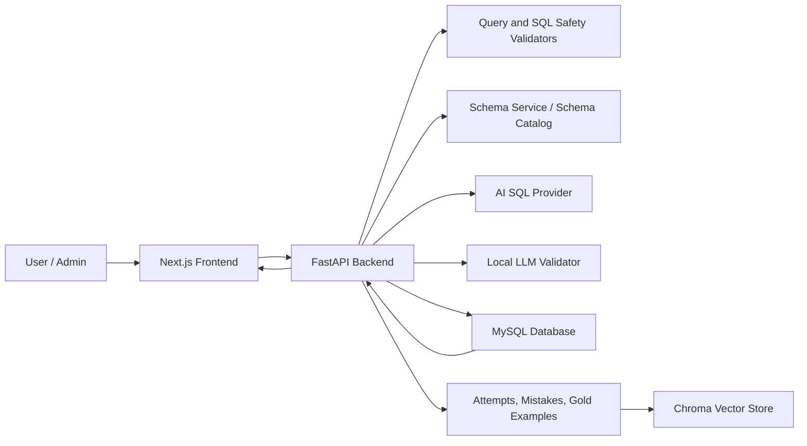
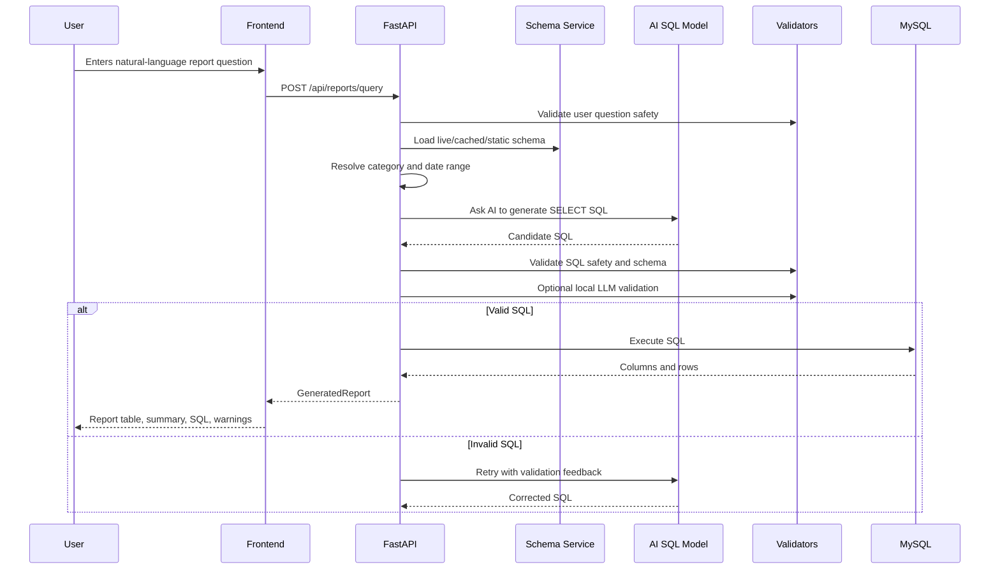

# Devita AI Reporting System - Technical Documentation

## 1. Project Overview

### Problem Solved

The Devita AI Reporting System converts natural-language business reporting questions into safe SQL queries against the Devita project-management database. Instead of asking users to know table names, joins, filters, or SQL syntax, the system lets them ask questions such as:

- "Show April 2026 revision summary by project and team leader"
- "Week 5 report with totals grouped by project type"
- "Projects where actual revision hours are greater than assigned hours"

The application then generates SQL, validates it, executes it against MySQL, and displays a structured report table.

### Main Purpose

The main purpose is to provide an AI-assisted reporting layer over the existing Devita operational database. It is designed for report generation, SQL inspection, retry/error visibility, and safe self-learning from approved successful SQL attempts.

### Target Users

- Project managers who need project, revision, timesheet, and capacity reports.
- Team leaders who need summaries of project work, tasks, bugs, and change requests.
- Admin users who review AI-generated SQL attempts and approve correct examples.
- Developers maintaining the reporting pipeline, schema catalog, prompts, and validation logic.

### Key Features

- Natural-language report query input.
- Report category detection and optional user-selected category.
- AI SQL generation using OpenRouter, Gemini, OpenAI, or local Ollama.
- MySQL schema introspection and cached schema catalog fallback.
- Safe read-only SQL validation.
- Local LLM-based second validation layer.
- Retry flow when generated SQL fails validation.
- Built-in SQL template fallback for common reports.
- Query execution against MySQL through SQLAlchemy.
- Frontend table rendering, summary cards, warnings, retry details, and generated SQL viewer.
- Admin dashboard for reviewing AI SQL attempts.
- Gold-example learning system using approved SQL attempts.
- SQL mistake storage so future prompts can avoid known bad patterns.
- Lightweight Chroma vector store using hash embeddings for similar approved examples.

## 2. System Architecture

### High-Level Architecture

### Frontend Role

The frontend lives in `frontend/` and is built with Next.js, React, TypeScript, and lucide-react icons.

Main screens:

- `frontend/app/page.tsx`: Main reporting interface where users enter report questions, select categories/providers, run reports, view results, warnings, retry attempts, and generated SQL.
- `frontend/app/admin/ai-sql-attempts/page.tsx`: Admin review dashboard for AI SQL attempts, gold-example approval, mistake review, and result preview.
- `frontend/lib/api.ts`: Typed API client for backend endpoints.

### Backend Role

The backend lives in `backend/app/` and is built with FastAPI, Pydantic, SQLAlchemy, PyMySQL, httpx, OpenAI SDK, and ChromaDB.

Main responsibilities:

- Expose HTTP APIs.
- Load settings from `.env`.
- Connect to MySQL.
- Fetch and cache schema metadata.
- Build AI SQL generation payloads.
- Validate user questions and generated SQL.
- Execute read-only report SQL.
- Store AI attempts, mistake examples, and approved gold examples.

### Database Role

MySQL is used for two purposes:

- Business data source: projects, tasks, users, attendance, timesheets, change requests, bugs, markup, BSL, checklist, and related tables.
- Application learning/audit storage: backend-created tables such as `ai_sql_attempts` and `sql_mistake_examples`.

### AI Model Role

The AI model is not trusted to execute directly. It only proposes SQL. The backend validates and optionally repairs the generated SQL before any execution.

Configured providers include:

- OpenRouter
- Gemini
- OpenAI
- Ollama local model

The system also supports a separate local validator model through `llm_output_validator.py`.

### User Input to Report Output Flow

## 3. Module-Wise Explanation

### Root Files

#### `README.md`

Explains the project purpose, backend/frontend setup, API list, database configuration, and AI provider configuration.

#### `AGENTS.md`

Contains repository-specific instructions for using the `graphify-out/` knowledge graph before architecture/codebase analysis.

#### `u678535045_devita_dev_db.txt` and `.pdf`

Appear to be database/schema reference material used to understand the Devita database.

#### `graphify-out/`

Generated project knowledge graph. `GRAPH_REPORT.md` identifies central code nodes such as `build_report()`, `_execute_with_schema_retries()`, `SchemaService`, `_generate_sql_payload()`, and validation classes.

### Backend Modules

#### `backend/app/main.py`

FastAPI application entry point.

Important endpoints:

- `GET /health`: Checks database configuration, database connectivity, and AI availability.
- `GET /api/schema`: Returns schema catalog.
- `POST /api/schema/refresh`: Forces live schema refresh.
- `GET /api/reports/catalog`: Returns report catalog.
- `GET /api/reports/categories`: Returns report categories.
- `POST /api/reports/query`: Runs the main report generation flow through `build_report()`.
- `GET /api/admin/ai-sql-attempts`: Lists generated SQL attempts.
- `POST /api/admin/ai-sql-attempts/{attempt_id}/review`: Reviews/approves attempts.
- `GET /api/admin/ai-sql-attempts/{attempt_id}/preview`: Executes a limited preview of final SQL.
- `GET /api/admin/sql-mistake-examples`: Lists stored SQL mistakes.

Connects to:

- `report_runner.build_report`
- catalog loaders
- admin attempt store
- mistake store
- schema service

#### `backend/app/models.py`

Defines Pydantic data contracts shared by API endpoints.

Important models:

- `ReportRequest`: User input, category, date filters, limit, dry-run flag, provider selection.
- `GeneratedReport`: Final response containing title, SQL, explanation, columns, rows, warnings, and retry attempts.
- `RetryAttempt`: Tracks validation/execution attempts.
- `ValidationResult`: Local LLM validator response shape.
- `AiSqlAttempt`: Admin view of stored SQL generation attempts.
- `SqlMistakeExample`: Stored failed SQL examples.
- `AiSqlAttemptPreview`: Admin preview response.

#### `backend/app/core/config.py`

Loads settings from the project-root `.env` file.

Important settings:

- Database: `DATABASE_URL`, `DB_HOST`, `DB_NAME`, `DB_USER`, `DB_PASSWORD`
- AI providers: OpenRouter, Gemini, OpenAI, Ollama
- LLM cache: path, TTL, enable flag
- Validator: local validator URL/model/retry settings
- Query limits and timeout
- CORS origins

The `resolved_database_url` property builds a MySQL SQLAlchemy URL when individual DB fields are provided.

#### `backend/app/db.py`

Database connection and query execution layer.

Important functions:

- `get_engine()`: Creates and caches a SQLAlchemy engine.
- `fetch_rows(sql, params)`: Executes SQL and returns column names plus rows as dictionaries.

Connects to:

- `get_settings()` for DB connection string and timeout.
- Report runner and admin preview modules for actual SQL execution.

#### `backend/app/services/report_runner.py`

Core orchestration module and most important backend file.

Important functions/classes:

- `ReportBuildError`: Structured error with title, solution, status, attempt ID, and retry attempts.
- `build_report(request)`: Main report pipeline.
- `_validate_generated_output_with_retries(...)`: Validates AI output, calls local validator, and asks AI to regenerate when needed.
- `_prepare_sql(...)`: Normalizes SQL, renders dates, and enforces SELECT-only rules.
- `_validate_cached_sql(...)`: Validates cached SQL before reuse.
- `_execute_with_schema_retries(...)`: Older/secondary execution helper that validates schema, repairs SQL, and falls back to template SQL.
- `_repair_generated_sql(...)`: Calls AI repair prompt.
- `_fallback_sql(...)`: Selects safe built-in template SQL.

How it connects:

- Reads settings through `get_settings()`.
- Calls `validate_user_query_safety()` before generation.
- Resolves category via `catalog.resolve_report_category()`.
- Resolves dates through `date_resolver.resolve_date_range()`.
- Loads schema through `schema_service`.
- Uses cached SQL through `llm_sql_cache`.
- Uses approved examples and mistake examples through attempt/mistake stores.
- Calls AI through `llm.py`.
- Validates SQL through `sql_guard`, `sql_safety_validator`, `schema_validator`, and `llm_output_validator`.
- Executes SQL through `db.fetch_rows()`.
- Stores attempt status through `ai_sql_attempt_store`.

#### `backend/app/services/llm.py`

Builds AI SQL prompts and calls provider APIs.

Important functions:

- `generate_sql_with_ai(...)`: First SQL generation call.
- `generate_sql_repair_with_ai(...)`: Repair call after schema/database error.
- `generate_sql_validation_retry_with_ai(...)`: Retry call after validation rejection.
- `build_sql_generation_payload_preview(...)`: Produces safe console/admin preview of prompt payload.
- `_build_sql_payload(...)`: Builds structured JSON payload with user question, dates, and requirements.
- `_generate_sql_payload(...)`: Selects provider and calls the proper implementation.
- `_generate_sql_with_openrouter(...)`
- `_generate_sql_with_ollama(...)`
- `_generate_sql_with_gemini(...)`
- `_generate_sql_with_openai(...)`
- `_parse_ai_sql(...)`: Extracts plain SQL from provider output.

Connects to:

- `backend/app/prompts/sql_system.md`
- `catalog.catalog_context()`
- settings for API keys/models/provider URLs

#### `backend/app/prompts/sql_system.md`

Primary SQL generation system prompt. It instructs the AI to return exactly one safe MySQL SELECT/CTE query, use documented schema only, avoid write/admin statements, include safe limits, use literal dates, and apply known Devita-specific schema rules.

#### `backend/app/services/llm_output_validator.py`

Second validation layer using a local validator model.

Important items:

- `VALIDATION_SYSTEM_PROMPT`: Strict validator prompt.
- `validate_llm_report_output(...)`: Calls local validator endpoint.
- `build_validation_payload(...)`: Sends user question, compact schema, and generated SQL.
- `_compact_schema(...)`: Includes all table names and only referenced table columns/relationships.
- `_parse_validation_result(...)`: Enforces JSON response shape.

This module reduces hallucination by making another model judge whether the first model's SQL is safe, schema-correct, and aligned with the user request.

#### `backend/app/services/sql_guard.py`

Low-level SQL guard.

Important functions:

- `validate_select_sql(sql)`: Allows only `SELECT` or `WITH`, blocks forbidden operations, and rejects multiple statements.
- `normalize_live_schema_sql(sql)`: Repairs known AI drift such as `timelog_records.time_spent` and MariaDB-incompatible JSON team-leader matching.
- `apply_limit(sql, limit)`: Adds a LIMIT when missing.

#### `backend/app/services/sql_safety_validator.py`

Higher-level SQL safety validator.

Important function:

- `validate_sql_safety(sql, schema, require_limit=True)`: Runs basic SQL safety, schema validation, and non-aggregate LIMIT enforcement.

It returns `SafetyValidationResult` with validity, reason, suggested fix, risk level, and mistake type.

#### `backend/app/services/query_safety.py`

First-pass user question safety checker.

Important function:

- `validate_user_query_safety(query)`: Blocks user requests containing write/admin operations and only allows reporting-style read questions.

This blocks dangerous intent before the system even asks an LLM to generate SQL.

#### `backend/app/services/schema_service.py`

Schema loading and caching service.

Important class:

- `SchemaService`

Important methods:

- `get_schema(force_refresh=False)`: Returns current schema from live DB, cache, or static fallback.
- `refresh_schema()`: Forces live refresh.
- `_fetch_live_schema_with_retry()`: Retries live schema introspection.
- `_convert_to_catalog_format()`: Converts live information_schema output to the app's schema catalog shape.
- `_schema_is_usable()`: Validates schema before use.

Schema priority:

1. Fresh cached schema if valid.
2. Live database introspection.
3. Stale cached schema.
4. Static `schema_catalog.json`.

#### `backend/app/services/db_to_schma.py`

Live MySQL schema introspection.

Important functions:

- `get_db_config()`: Reads DB settings.
- `get_mysql_schema_json()`: Reads tables, columns, and foreign keys from `information_schema`.
- `get_mysql_schema_json_legacy()`: JSON string wrapper.

Note: filename contains a typo: `db_to_schma.py`.

#### `backend/app/services/schema_validator.py`

Schema-aware SQL validation.

Important functions/classes:

- `SchemaDiagnosis`: Describes missing table/column problems.
- `SchemaValidationError`: Raised on schema mismatch.
- `validate_schema_catalog(schema)`: Ensures catalog shape is usable.
- `build_schema_index(schema)`: Builds table/alias/column lookup.
- `validate_sql_against_schema(sql, schema)`: Checks SQL table and aliased column references.
- `diagnose_database_error(error, schema)`: Converts MySQL unknown table/column errors into actionable diagnosis.

#### `backend/app/services/catalog.py`

Loads schema/report/category catalogs and builds prompt context.

Important functions:

- `load_schema_catalog()`
- `load_report_catalog()`
- `load_report_categories()`
- `resolve_report_category(category_id, question)`
- `catalog_context(category)`

This is what turns JSON metadata into AI-readable schema/report context.

#### `backend/app/services/report_categories.py`

An alternative category helper module. It loads categories, detects category from keywords, and builds category prompt context. The active report runner imports category resolution from `catalog.py`, so this module appears partly overlapping and could be consolidated later.

#### `backend/app/services/templates.py`

Safe built-in SQL templates for common reports.

Templates include:

- Attendance Report
- Team Timesheet Report
- Week Five Report
- Project Summary Report
- Post Error Report
- Revision Summary by Project and Team Leader

Important function:

- `find_template(question, category_id)`: Scores templates by keyword and category.

#### `backend/app/services/date_resolver.py`

Converts natural-language date phrases into explicit date ranges.

Examples:

- "April 2026" -> `2026-04-01` to `2026-04-30`
- "this month" -> current month
- "last month" -> previous calendar month
- "this year" -> current calendar year

Important function:

- `resolve_date_range(question, start_date, end_date)`

#### `backend/app/services/llm_sql_cache.py`

Caches generated SQL to avoid repeated AI calls for similar requests.

Important functions:

- `get_cached_sql(...)`
- `set_cached_sql(...)`
- `invalidate_cache(...)`
- `build_cache_identity(...)`
- `schema_version(schema_snapshot)`

Cache identity includes normalized question, canonical intent tokens, dates, limit, report category, and schema version.

#### `backend/app/services/ai_sql_attempt_store.py`

Stores AI SQL attempts in MySQL and manages gold-example promotion.

Important functions:

- `ensure_ai_sql_attempts_table()`
- `create_attempt(...)`
- `update_attempt(...)`
- `list_attempts(...)`
- `get_attempt(...)`
- `review_attempt(...)`
- `similar_gold_examples(...)`

Gold examples are successful, correct, admin-approved, read-only attempts with final SQL and no execution error.

#### `backend/app/services/sql_mistake_store.py`

Stores failed SQL examples in MySQL.

Important functions:

- `ensure_sql_mistake_examples_table()`
- `create_mistake_example(...)`
- `update_attempt_mistakes_with_final_sql(...)`
- `list_mistake_examples(...)`
- `similar_mistake_examples(...)`

Mistakes are later included in prompts as examples of patterns the AI should avoid.

#### `backend/app/services/gold_vector_store.py`

Persistent Chroma vector store for approved gold examples.

Important functions:

- `upsert_gold_example(attempt)`
- `search_gold_examples(question, limit)`
- `is_vector_store_available()`

It uses a deterministic hash embedding function rather than external embedding APIs.

#### `backend/app/services/admin_attempt_preview.py`

Allows admin users to preview final SQL results safely.

Important function:

- `preview_attempt_rows(attempt_id, limit)`: Loads attempt, validates final SQL, applies preview LIMIT, executes read-only query.

#### `backend/app/services/schema_updater.py`

Present in the repository but not part of the main execution flow inspected here. It is likely intended for schema update/refresh support.

### Backend Data Files

#### `backend/app/data/schema_catalog.json`

Static schema metadata fallback used when live DB schema and cache are unavailable.

#### `backend/app/data/schema_cache.json`

Cached live schema generated by `SchemaService`.

#### `backend/app/data/report_catalog.json`

Business report metadata listing report types, expected tables, required columns, and metrics.

#### `backend/app/data/report_categories.json`

Category configuration for report detection and prompt guidance. Categories include project, task, attendance, timesheet, revision, quality, product, team/employee, BSL, checklist, and markup.

#### `backend/app/data/llm_sql_cache.json`

JSON cache of validated AI-generated SQL.

#### `backend/app/data/vector_store/`

Persistent Chroma vector database for gold SQL examples.

### Frontend Modules

#### `frontend/lib/api.ts`

Typed API wrapper around FastAPI endpoints.

Important functions:

- `runReport(payload)`
- `getHealth()`
- `listReportCategories()`
- `listAiSqlAttempts(goldOnly)`
- `reviewAiSqlAttempt(...)`
- `listSqlMistakeExamples()`
- `previewAiSqlAttempt(...)`

#### `frontend/app/page.tsx`

Main user interface. Responsibilities:

- Shows Devita-style dashboard layout.
- Loads health and report categories.
- Lets user type report questions.
- Lets user choose report category and SQL provider.
- Calls `runReport()`.
- Shows errors, retry attempts, report summary, warnings, result table, and generated SQL.
- Formats numeric, date, status, and object cell values.

#### `frontend/app/admin/ai-sql-attempts/page.tsx`

Admin review screen. Responsibilities:

- Lists attempts and mistakes.
- Shows success/failure/gold KPIs.
- Previews final SQL output.
- Approves, rejects, marks correct, or marks incorrect.
- Promotes valid attempts into gold examples.

#### `frontend/app/globals.css`

Global styles for the main reporting UI and admin dashboard.

#### `frontend/app/layout.tsx`

Next.js root layout and metadata.

## 4. Database Usage

### Database Used

The system uses MySQL through SQLAlchemy and PyMySQL.

Connection is configured in `.env` using either:

- `DATABASE_URL`
- or individual fields: `DB_HOST`, `DB_NAME`, `DB_USER`, `DB_PASSWORD`, optional `DB_PORT`

### Schema Fetching and Storage

Schema is fetched from MySQL `information_schema` by `backend/app/services/db_to_schma.py`.

The system fetches:

- table names from `information_schema.tables`
- column metadata from `information_schema.columns`
- foreign-key relationships from `information_schema.key_column_usage`

`SchemaService` converts live schema into catalog format and writes it to `backend/app/data/schema_cache.json`.

If live fetch fails, the system uses:

1. stale schema cache
2. static schema catalog
3. error if neither is available

### Business Tables Used

The schema/report catalogs indicate support for reports over tables such as:

- `projects`
- `project_type`
- `product_task`
- `product_task_details`
- `timelog_records`
- `attendances`
- `users`
- `changerequest_management`
- `task_bug_management`
- `markup_management`
- BSL-related tables
- checklist/product/sheet-related tables

### Application-Created Tables

The backend creates tables if needed:

#### `ai_sql_attempts`

Stores each AI SQL generation attempt:

- user question
- schema snapshot
- generated SQL
- regenerated SQL
- final SQL
- validator status/feedback
- execution status/error
- row count
- admin review state
- gold-example flags

#### `sql_mistake_examples`

Stores failed SQL patterns:

- wrong SQL
- validator feedback
- mistake type
- risk level
- corrected/final SQL

### SQL Generation and Execution

SQL is generated by an AI provider or selected from a built-in template.

Before execution, SQL must pass:

- user query safety check
- SQL SELECT/CTE-only validation
- forbidden keyword validation
- multiple-statement rejection
- schema table/column validation
- local LLM validation when enabled
- optional LIMIT validation

Execution happens through:

- `fetch_rows(sql, params)` in `backend/app/db.py`
- SQLAlchemy `text(sql)`
- MySQL connection from `get_engine()`

## 5. AI Reporting Flow

### Step-by-Step Flow

1. User asks a report question in the frontend.

2. Frontend sends `POST /api/reports/query` with:
   - `question`
   - `report_category`
   - `limit`
   - `dry_run`
   - `sql_generation_provider`

3. Backend validates the user question with `validate_user_query_safety()`.
   - Blocks write/admin intent.
   - Allows read/report/list/count/summary-style questions.

4. Backend detects or applies the report category.
   - Uses selected category unless set to auto.
   - Uses category keyword matching for auto-detection.

5. Backend resolves dates.
   - Explicit dates are preserved.
   - Phrases like "April 2026" or "this month" are converted into start/end dates.

6. Backend loads schema.
   - Uses live/cached/static schema through `schema_service.get_schema()`.

7. Backend creates an AI SQL attempt record.
   - Stores user question and schema snapshot.

8. Backend checks SQL cache.
   - If a cached SQL match exists, it is still revalidated before use.

9. Backend searches learning examples.
   - Approved gold examples are found through vector search or token similarity.
   - Similar mistake examples are found through token similarity.

10. Backend builds AI prompt payload.
   - Includes question, dates, category guidance, schema/report catalog context, approved examples, mistake examples, and safety requirements.

11. AI provider generates SQL.
   - Provider can be OpenRouter, Gemini, OpenAI, or Ollama.

12. Backend prepares SQL.
   - Removes trailing semicolon.
   - Normalizes known schema drift.
   - Replaces date placeholders with literal values when needed.
   - Enforces SELECT/CTE-only.

13. Backend validates SQL safety and schema.
   - Blocks dangerous SQL.
   - Ensures tables and aliased columns exist in schema.
   - Requires LIMIT for non-aggregate result lists when configured.

14. Local LLM validator checks the generated SQL.
   - Verifies safety, schema correctness, and user-request alignment.

15. If validation fails, backend stores mistake example and retries.
   - AI receives failed SQL and validator reason.
   - AI regenerates corrected SQL.
   - Retry count is bounded.

16. If AI is unavailable or rejected, backend may use a built-in template.

17. If `dry_run` is false, backend executes SQL.
   - Returns columns and rows.
   - Updates attempt status.
   - Updates mistake examples with final correct SQL when applicable.

18. Frontend displays:
   - report title
   - summary
   - row/column counts
   - table data
   - warnings
   - retry attempts
   - generated SQL

## 6. Prompt Engineering

### Prompt 1: SQL System Prompt

Location: `backend/app/prompts/sql_system.md`

Role:

- Defines the SQL generation behavior for the primary AI model.
- Requires one plain-text MySQL SELECT/CTE query.
- Blocks JSON, markdown, explanation, comments, metadata, and prose.
- Requires documented tables/columns only.
- Blocks dangerous SQL operations.
- Adds Devita-specific schema rules.

How it reduces hallucination:

- Tells the model to use only supplied schema/catalog.
- Names known table/column rules such as `product_task.task_status`.
- Gives MariaDB-compatible logic for `projects.team_leader`.
- Tells model not to invent JSON casting unsupported by MariaDB.
- Tells model to use approved examples only as reference, not as truth.

### Prompt 2: SQL Generation Payload

Location: `_build_sql_payload()` in `backend/app/services/llm.py`

Role:

- Sends the user question, resolved dates, and generation requirements as JSON text.
- Adds rules such as safe LIMIT handling, literal date values, SELECT-only output, and clarification behavior.

How it reduces hallucination:

- Makes the user request explicit and structured.
- Adds deterministic date values.
- Separates rules from natural-language question.
- Reminds the model that unclear questions should return `clarification_needed`.

### Prompt 3: Catalog Context

Location: `catalog_context()` in `backend/app/services/catalog.py`

Role:

- Supplies schema tables, columns, aliases, report catalog, and selected category context to the AI.

How it reduces hallucination:

- Gives the model actual table and column names.
- Includes report-specific metrics and expected tables.
- Optionally restricts context to category allowed tables in strict mode.

### Prompt 4: Correct Approved Examples

Location: `generate_sql_with_ai()` in `backend/app/services/llm.py`

Role:

- Includes similar admin-approved SQL examples from previous successful attempts.

How it reduces hallucination:

- Gives working join/filter/metric patterns.
- Labels examples as references only.
- Prevents blind copying by making current question and schema authoritative.

### Prompt 5: Past Mistakes to Avoid

Location: `generate_sql_with_ai()` and `sql_mistake_store.py`

Role:

- Includes similar failed SQL examples, validation reasons, and corrected SQL when available.

How it reduces hallucination:

- Shows the model what went wrong previously.
- Warns against repeating invalid table/column names or unsafe patterns.

### Prompt 6: Repair Prompt

Location: `generate_sql_repair_with_ai()` in `backend/app/services/llm.py`

Role:

- Sends failed SQL and error message to generate a corrected replacement query.

How it reduces hallucination:

- Makes the exact schema/database failure visible.
- Tells the model not to repeat the invalid table/column.
- Requires it to choose valid tables, columns, aliases, and joins.

### Prompt 7: Validation Retry Prompt

Location: `generate_sql_validation_retry_with_ai()` in `backend/app/services/llm.py`

Role:

- Sends validation errors and retry prompt back to the generation model.

How it reduces hallucination:

- Forces correction of every validation error.
- Reasserts unsafe/invalid SQL must not be repeated.
- Allows retry without changing the original user question.

### Prompt 8: Local Validator Prompt

Location: `VALIDATION_SYSTEM_PROMPT` in `backend/app/services/llm_output_validator.py`

Role:

- Makes a second local model validate the first model's SQL.
- Requires strict JSON response.
- Checks safety, schema correctness, and alignment with explicit top/limit requests.

How it reduces hallucination:

- Separates SQL generation from SQL judgment.
- Rejects plausible-but-nonexistent schema names.
- Prevents the model from forgiving close matches.
- Produces one clear reason for retry.

## 7. Validation and Safety

### User Query Safety

`query_safety.py` blocks user input containing write/admin operations such as:

- insert
- update
- delete
- drop
- alter
- truncate
- create
- grant
- revoke
- merge
- replace
- call
- execute

Only reporting/read-style questions are allowed.

### SQL Safety

`sql_guard.py` and `sql_safety_validator.py` enforce:

- only `SELECT` or `WITH`
- no forbidden write/admin keywords
- no multiple SQL statements
- no SQL comments
- LIMIT required for non-aggregate row-list queries
- schema validation before execution

### Schema Safety

`schema_validator.py` checks:

- referenced tables exist
- table aliases map to known tables
- aliased columns exist on the referenced table
- missing table/column errors produce actionable suggestions

### AI Output Validation

`llm_output_validator.py` optionally calls a local LLM validator. It checks:

- SQL is safe
- SQL is schema-correct
- SQL matches explicit user limit requirements
- response is valid JSON

### Retry Logic

In `report_runner.py`, generated SQL can be retried when:

- schema validation fails
- SQL safety validation fails
- local LLM validator rejects output
- generated SQL does not match explicit top/limit request

Failed attempts are stored as `RetryAttempt` objects and returned to the frontend.

The retry flow:

1. Validate generated SQL.
2. Save mistake example when invalid.
3. Build retry payload containing failed SQL and validator reason.
4. Ask AI to regenerate.
5. Validate regenerated SQL.
6. Stop after bounded retries and return structured error if still invalid.

### Error Handling

Errors are converted into user-facing `ReportBuildError` values with:

- title
- message
- solution
- HTTP status code when applicable
- attempt ID
- retry attempts

Frontend displays these in an error card and retry panel.

### Safety Limitations

The system uses regex-based SQL parsing for several checks. This is useful but not as strong as a full SQL parser. Production hardening should add an AST-based SQL parser or database-level read-only permissions.

## 8. Development Planning

This project appears to have been built iteratively with generated code. A planned development approach would look like this:

### Requirement Gathering

- Identify target reports: project summary, week-five, revision, attendance, timesheet, post-error, capacity, markup, BSL, checklist.
- Identify user roles: project manager, team leader, admin, developer.
- Define allowed report actions: read-only SELECT reports only.
- Define output expectations: table, summary, SQL view, warnings, export needs.
- Define safety expectations: no data mutation, schema validation, retry/error visibility.

### Feature Breakdown

- Backend API service.
- Database connection and schema introspection.
- Static schema/report/category catalogs.
- AI SQL generation service.
- SQL safety validator.
- Schema validator.
- Local validator model.
- Report execution service.
- Frontend report UI.
- Admin SQL review UI.
- Attempt/mistake/gold-example storage.
- Caching and learning loop.

### Architecture Design

Recommended layers:

- API layer: FastAPI routes only.
- Application/service layer: report orchestration.
- AI layer: prompt and provider adapters.
- Validation layer: user query, SQL safety, schema, LLM validator.
- Data layer: SQLAlchemy connection, schema fetch, attempt/mistake storage.
- Frontend layer: user dashboard and admin dashboard.

### Database Planning

- Document business tables and relationships.
- Create stable schema catalog format.
- Decide what schema metadata comes from live DB vs manual descriptions.
- Create application tables for AI audit and learning.
- Use read-only database user for report execution.
- Define indexes for attempt/mistake tables.

### API Planning

- `GET /health`
- `GET /api/schema`
- `POST /api/schema/refresh`
- `GET /api/reports/catalog`
- `GET /api/reports/categories`
- `POST /api/reports/query`
- `GET /api/admin/ai-sql-attempts`
- `POST /api/admin/ai-sql-attempts/{id}/review`
- `GET /api/admin/ai-sql-attempts/{id}/preview`
- `GET /api/admin/sql-mistake-examples`

### UI Planning

- Report question entry.
- Category selector.
- Provider selector.
- Health indicator.
- Result table.
- Generated SQL toggle.
- Retry/error panel.
- Admin attempt list.
- Admin preview table.
- Gold-example approval workflow.

### Testing Planning

- Unit tests for query safety and SQL guard.
- Unit tests for schema validation.
- Unit tests for date resolver.
- Unit tests for report category detection.
- Integration tests for `/api/reports/query` dry-run.
- Mock-provider tests for AI generation and retry flow.
- Database integration tests against a test MySQL schema.
- Frontend tests for API error display and table formatting.
- Security tests for dangerous SQL prompts.

## 9. Junior Developer Explanation

Think of this project as a smart report assistant.

Normally, if a manager wants a report, a developer has to write SQL manually. This system tries to automate that:

1. The user types a question like "Show revision summary for April 2026."
2. The frontend sends that question to the backend.
3. The backend checks that the question is only asking to read data, not change/delete anything.
4. The backend loads the database schema so it knows which tables and columns exist.
5. The backend asks an AI model to write a MySQL `SELECT` query.
6. The backend does not trust the AI immediately.
7. It checks the SQL for dangerous commands.
8. It checks that the tables and columns exist.
9. It may ask a second validator model to review the SQL.
10. If SQL is wrong, it asks the AI to fix it.
11. If SQL is safe, it runs it on MySQL.
12. The result rows are sent back to the frontend.
13. The frontend shows the report in a table.

There is also an admin screen. Admins can review generated SQL. If a SQL query was correct, they can approve it as a "gold example." Next time, the AI can use that example as guidance.

The most important rule is: AI can suggest SQL, but backend validation decides whether it is allowed to run.

## 10. Future Improvements

### Refactoring Improvements

- Consolidate overlapping category logic in `catalog.py` and `report_categories.py`.
- Rename `db_to_schma.py` to `db_to_schema.py`.
- Split `report_runner.py` into smaller services:
  - request preparation
  - AI generation
  - validation/retry
  - execution
  - attempt logging
- Replace regex SQL validation with a SQL parser/AST validator.
- Create repository classes for attempt and mistake storage.
- Move Devita-specific SQL normalization rules into a dedicated compatibility module.

### Production-Level Improvements

- Use a read-only MySQL user for report execution.
- Add database query timeout enforcement at DB/session level.
- Add row/column export controls and pagination.
- Add authentication and role-based access control.
- Protect admin endpoints.
- Add structured logging with request IDs.
- Add monitoring for AI provider latency, validation failures, and SQL execution time.
- Add automated migrations instead of `CREATE TABLE IF NOT EXISTS` inside request paths.
- Store secrets securely instead of plain `.env` for production.
- Add rate limiting.
- Add audit log for report access.
- Add test database and CI pipeline.
- Add input/output redaction for sensitive data.
- Add support for saved reports and scheduled reports.
- Add full report export implementation for PDF/Excel.

### AI Improvements

- Use a proper embedding model for gold examples instead of hash embeddings.
- Add benchmark questions with expected SQL.
- Add prompt versioning.
- Store model/provider used for each attempt.
- Evaluate generated SQL before and after prompt changes.
- Add confidence scoring and ask-for-clarification behavior for ambiguous questions.
- Use schema-aware retrieval to include only relevant tables in prompt context.

### Frontend Improvements

- Implement working month/year/date filters in the report request payload.
- Add pagination for large result sets.
- Add CSV/Excel/PDF export.
- Add saved prompt/report history.
- Add loading progress for generation, validation, and execution stages.
- Add responsive admin table improvements for smaller screens.

### Documentation Improvements

- Add API reference with request/response examples.
- Add database ER diagram.
- Add deployment guide.
- Add prompt lifecycle/change-management guide.
- Add troubleshooting guide for AI provider, DB connection, schema refresh, and validator failures.

